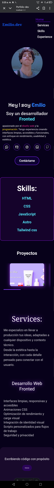
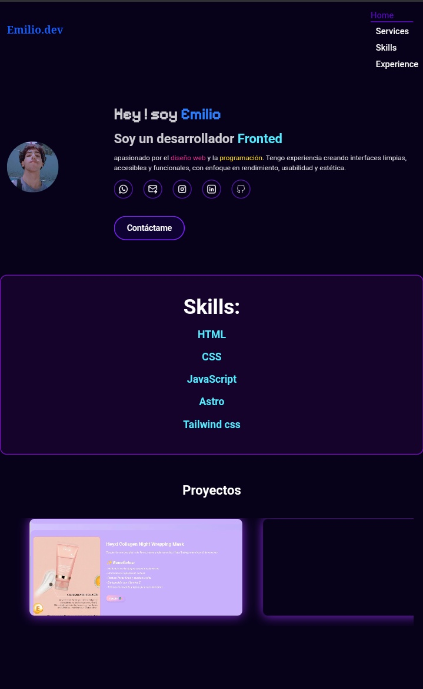
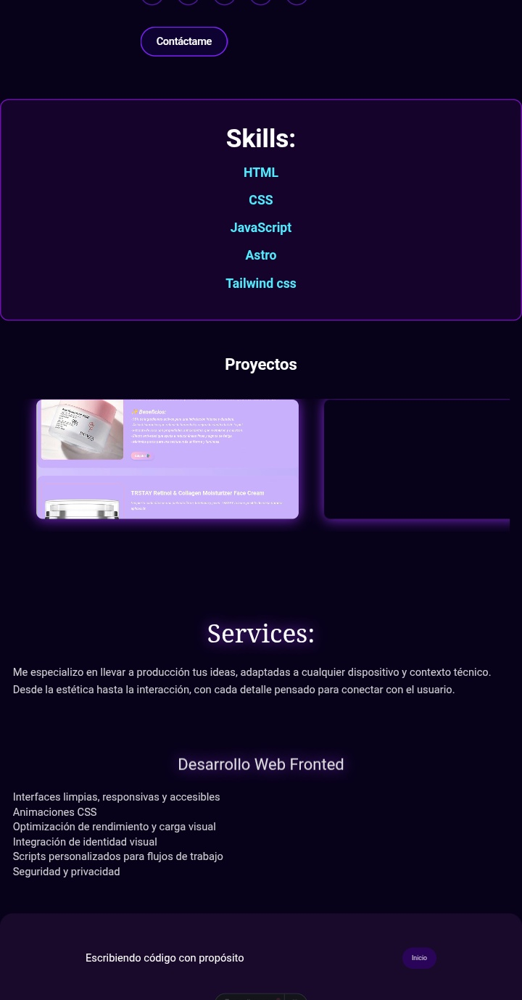

<section style="background-color: #001f4d; color: white; padding: 2rem; font-family: 'Segoe UI', sans-serif; line-height: 1.6;">
  <h1 style="color: #ff4d4d; font-size: 2.5rem; margin-bottom: 1rem;">🌐 Emilio.dev — Portafolio Web Personal</h1>

  

    Bienvenido al repositorio de mi portafolio personal. Este sitio está diseñado para reflejar mi estilo, habilidades y experiencia, combinando estética, rendimiento y accesibilidad.
  

  

  <h2 style="color: #66ccff;">🚀 Tecnologías Utilizadas</h2>
  <ul style="list-style: disc; padding-left: 1.5rem;">
    <li>Astro</li>
    <li>Tailwind CSS</li>
    <li>HTML</li>
    <li>CSS</li>
    <li>JavaScript</li>
  </ul>

  <h2 style="color: #66ccff; margin-top: 2rem;">✨ Características</h2>
  <ul style="list-style: disc; padding-left: 1.5rem;">
    <li>Diseño responsivo</li>
    <li>Animaciones y efectos visuales CSS</li>
    <li>Carrusel de proyectos</li>
    <li>Mínimo uso de JavaScript</li>
  </ul>

  <h2 style="color: #66ccff; margin-top: 2rem;">📁 Estructura del Proyecto</h2>
  <pre style="background-color: #00264d; padding: 1rem; border-radius: 8px; overflow-x: auto;">
<code style="color: #99ccff;">
/
├── public/
│   ├── img/
│   ├── vid/
│   ├── fonts/
│   └── scripts/
├── src/
│   ├── components/
│   │   ├── Header.astro
│   │   ├── Hero.astro
│   │   ├── Technologias.astro
│   │   ├── Experience.astro
│   │   ├── Servicios.astro
│   │   └── Footer.astro
│   ├── layouts/
│   │   └── Layout.astro
│   ├── pages/
│   │   └── index.astro
│   └── styles/
├── package.json
└── LICENSE.txt
</code>
  </pre>

  <h2 style="color: #66ccff; margin-top: 2rem;">📸 Vista Previa</h2>
  
  
  
  
  
  
  
  
---
  <h2 style="color: #66ccff; margin-top: 2rem;">📄 Licencia</h2>
  

    Este proyecto está licenciado bajo <strong>Creative Commons BY-NC-ND 4.0</strong>. Puedes compartirlo libremente, pero no modificarlo ni usarlo con fines comerciales.
  

  <h2 style="color: #66ccff; margin-top: 2rem;">👤 Autor</h2>
  

    <strong>Emilio</strong> — Desarrollador frontend apasionado por el diseño web, la accesibilidad y la experiencia de usuario :) 
    📫 Contacto: <a href="mailto:kei.hexcode@gmail.com" style="color: #99ccff;">Email</a>
  

</section>
